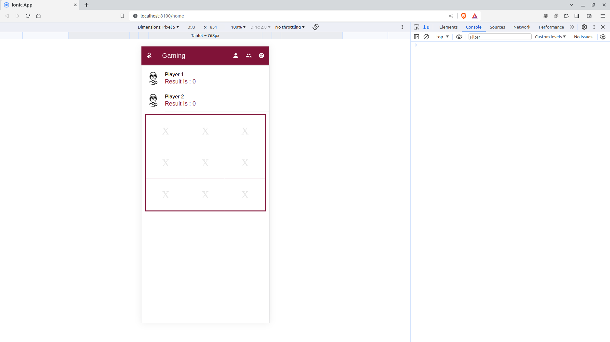

# XO-Game

This is an Ionic mobile app for playing the classic XO game. It features a simple and intuitive user interface, and supports both single-player and multiplayer modes.


## Screenshots




## Features

- Simple and intuitive user interface
- Single-player and multiplayer modes
- High scores leaderboard


## Requirements

- Node.js v16 or higher
- Ionic Framework


## Installation
-  Clone this repository:

```bash
  git clone https://github.com/mahmoudashraf-code/XO-game.git
  cd XO-game
```
- Install dependencies:

```bash
  npm i
```


## Usage

-  Start App:
```bash
  ionic serve
```

- Open a web browser and go to http://localhost:8100


## Security
This app does not store any of your personal information. All communication between the client and server is encrypted over HTTPS.


## Troubleshooting
If you are having any problems with this app, please open an issue on GitHub.


## License
This app is licensed under the [MIT](https://choosealicense.com/licenses/mit/) License.


